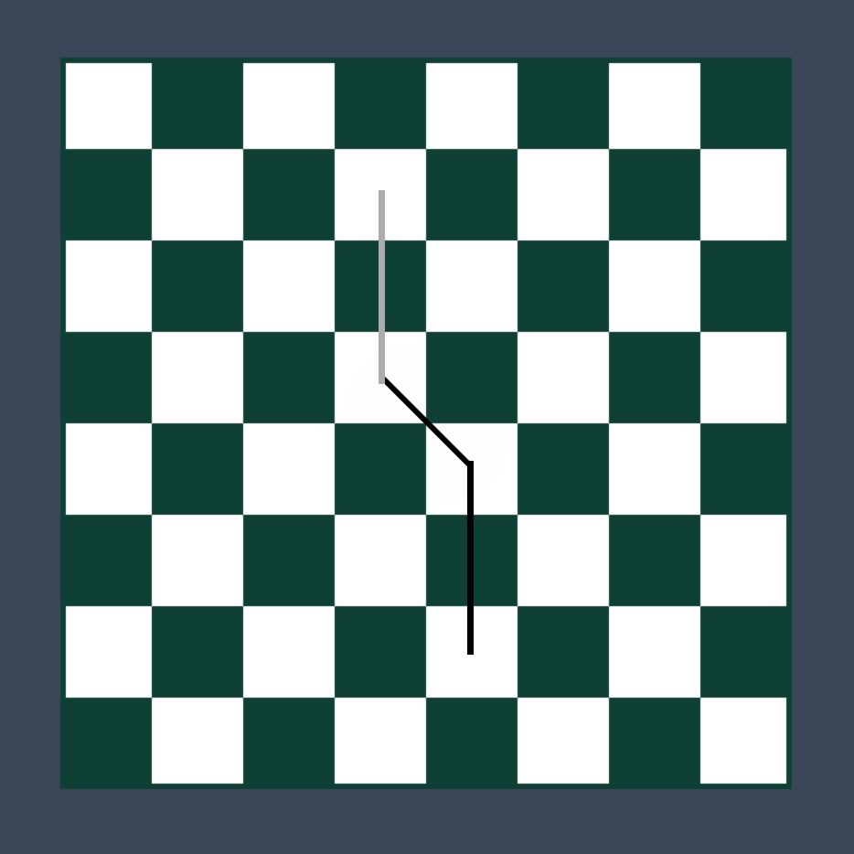

#*Chess Game Moves Line Creator*
##Independent Programming Project

<i><b>Description</b></i>: This project will focus on taking chess game data in the form of turns in a .pgn file and transfer them into lines drawn based on the movement of chess pieces.

<b>[Sample Proof of Concept]</b>:
  Sample input (2 lines read from file): 
e4 d5 
exd5 
Sample description:
  White makes its first move, moving its e pawn to e4.  
Black responds by moving its d pawn to d5. 
White takes black's d pawn.
Sample image output:

<b>Goal:</b> The main goal of this project is two-fold.
 1. To interpret a .pgn text file (after slight manipulation) and be able to tell from each line of the text file, what move was made (i.e. determine starting and ending positions of each move). This is done by seeing the current board position after each move by looking at the Forsyth–Edwards Notation of the chess board using an external module "pgnToFen.py".
 2. To draw lines on a graphical chessboard (from the center of tiles) based on the moves made.

<b>Approach:</b> Pygame will be used as it will allow for the text manipulation python provides alongside with the graphics features of pygame.